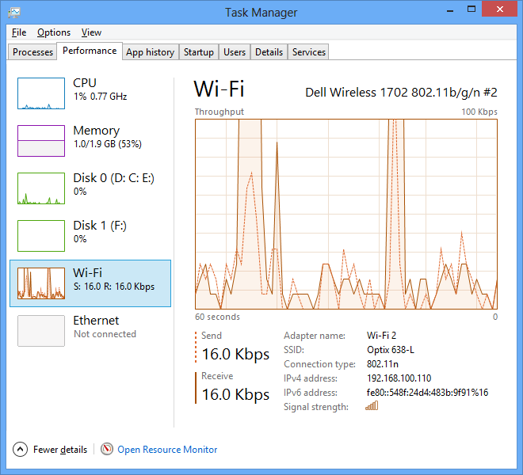
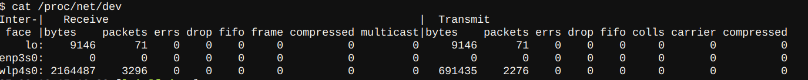
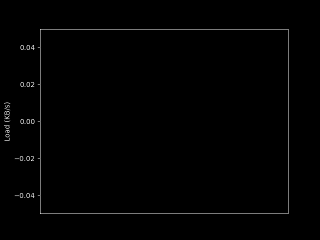
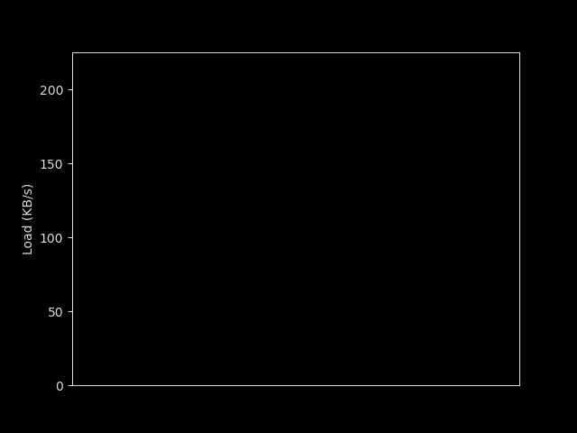
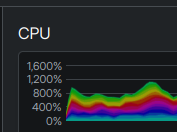
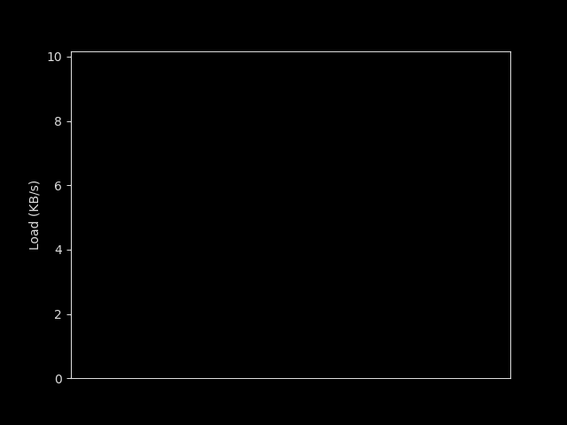

+++
title = 'How to Calculate an Initial Instantaneous Measurement of Metrics on Cumulative Indicators in Real Time'
date = 2025-02-28T17:18:38-03:00
draft = false
+++

Suppose we need to calculate data from a cumulative indicator to generate real-time graphs or metrics for and application's users to look at. However, this indicator is managed by an external process, and we have no way of knowing exactly when it is updated. What strategies can we adopt to process this information?

This is a problem I encountered in a project that initially seems simple. However, its solution involves some interesting ideas and it's present in various software features we interact with daily.

A good example of an application that directly deals with this type of problem are system resource monitors, such as System Monitor (on Linux), Task Manager (on Windows), or server resource monitoring tools. These applications handle this problem to calculate graphs showing network traffic volume that passes through the machine's network interfaces.

These graphs are generally built using the following strategy:

The Operating System is responsible for coordinating hardware communication. It processes received data to assemble packets, sends them to applications, and also receives packets from applications to be processed and sent to the hardware. During this process, the system, as an intermediary for all communication, can record statistics of data received and sent by network interfaces. It then accumulates indicators to reflect the data it has processed. However, it doesn't maintain a history of these values, as this would require the RAM usage to always be growing, creating a memory leak. Therefore, it saves only a monotonic indicator.

In Linux, for example, the system accounts for input and output indicators such as: bytes, packets, errors, drops, FIFO, frames, compression, and multicast in the virtual file `/proc/net/dev`.

Given that in our example case, the intention is only to calculate the volume of bytes received or sent by the adapter, a monitoring application can use the `bytes` indicator, which is always incremental and has two versions that account for the total bytes received and sent by the interface since its initialization.

Looking at our indicator, we see the premises our problem:

- The indicator is always incremental
- We have no record of previous values
- We have no control over exactly when this value is updated

With this, it's possible to use this application of the problem to investigate how to calculate a metric under the same conditions. To simplify the example, we'll focus only on the download rate, but the same ideas would also apply to the upload rate.

In this article, using the example, I'll explore how to generate these metrics and, more deeply, how to approach calculating the first real-time indicator.

# Defining the Data Model

First, the indicator calculation is fairly simple, as there's already a well-established data model for interpreting this kind of problem: a time series. We can define a  ∆t interval, which can be used to repeatedly capture indicator data, and from this data build the time series. Therefore, each record in the series would follow the following format:

(timestamp, current bytes)

Then, the series can be defined as 

\[
\begin{aligned}
S_{c} = (i=0,...n)\left\{ \left< t_{i},bytes_{i}\right>\right\}
\end{aligned}
\]
where:
\[
\begin{aligned}
t_{x} = t_{0} + \Delta t \times x
\end{aligned}
\]

and i is a number indicating the current element (starting from zero)

Of course, for efficiency reasons, it wouldn't be feasible to keep the entire series in memory, as it grows continuously, which would eventually generate a significant impact on system memory usage. The use of time series simplifies the modeling, and with it defined, we can keep in memory only the records needed for calculations at that time.

Using this series, we can now calculate the variation in download speed at each instant, generating a new series:

\[
\begin{aligned}
S_{d} = (i=0,...n)\left\{ \left< t_{i},bytes_{i} - bytes_{i-1}\right>\right\}
\end{aligned}
\]

And from this, it's possible to customize how to update the indicator to make it more user-friendly, using well-established time series processing techniques. A good example for our network case would be moving windows.

But our indicator has a problem, which is important in some situations.

## Problems with the Model

Notice that in our derived time series, we depend on the presence of \( t_{i-1} \) to calculate \( t_{i} \), but this would depend on the existence of a \( t_{-1} \) to calculate \( t_{0} \), which isn't possible. For many applications, this isn't relevant, because we could compute the indicator only from \(i = 1\). However, this prevents the indicator from being displayed immediately to the user, forcing them to wait ∆t to see the first value, which might not be ideal for the application's needs, as is the case with a resource monitor, where the user expects the program to open instantly.

This is the most interesting part of this problem that I hadn't seen mentioned before: techniques for computing this indicator immediately.

Although none of them is perfect, they require a creative outlook on the problem, which leads to some interesting ideas.

# Calculating the First Item

The first technique, which is the simplest but has significant deviations  representing the current state, is to simply define \( S_{d_{0}} = (t_{0}, 0) \), using 0 as a placeholder for the first position.

Despite the advantage of being simpler, if the user doesn't know about this behavior, they might get the wrong idea that the indicator suddenly jumped right after opening the monitoring tool.

The next techniques also depend somewhat on manipulating the data in a not completely accurate way, but in a way that better informs the user about the current context.

But to use them, we would first need to think about our data model a little differently.

## New Data Model

For the next techniques, we will need to loosen our dependency on the fact that our data will be collected exactly between each ∆t interval .

To simplify the definition of the solution, let's first define the function \(vS_{d}(x)\) that returns the value of the series \(S_{c}\) when i = x.

What we need for the next approaches is a formula where even if the time interval between \(S_{c_{i}}\) and \(S_{c_{i-1}}\) used is different from Δt, it's proportionally comparable to the other items in the series. One way to do this is by defining \(S_{d}\) as:

\[
\begin{aligned}
S_{d} = (i=0,...n)\left\{ \left< t_{i},  (\frac{ \Delta t }{ t_{i} - t_{i-1} }) \times ( vS_{c}(i) - vS_{c}(i-1)  )   \right>\right\}
\end{aligned}
\]

In other words, for each item in the \(S_{d}\) series, we consider the last 2 items of the \(S_{c}\) series, but converted proportionally to the relationship between its measurement time interval and the standard series time \(∆t\).

With this definition of the \(S_{d}\) series, we can proceed to the next solutions.

## Second Solution

The second approach arises when we realize that there is a single moment in time that we know exists prior to \( t_{0} \), which is the moment the indicator began to be incremented (and its value, which is zero) given that it is monotonic.

Considering this, we can define an imaginary \( S_{c_{-1}} \) with this value, and start calculating our \( S_{d} \) from i=0. Thus, the first item in our series would consist of the average variation since the beginning of the indicator.

Using the download rate calculation example, for this approach, we would need to replace the `timestamp` with the system's `uptime` time variable. The `uptime` counts how many nanoseconds have passed since the system was turned on, while the `timestamp` counts from January 1, 1970. The `uptime` is useful for us in this approach because it's a good approximation of when our network interface started working (and consequently when the bytes indicator began to be incremented). Following this strategy, we could define an imaginary \(S_{c_{-1}} = 0\), and with this, our \(S_{d_{0}}\) would effectively be:

\[
\begin{aligned}
S_{d_{0}} = \frac{ \Delta t }{ t_{uptime} } \times vS_{c}(0)
\end{aligned}
\]

Which would be the average usage since the computer was turned on.

Here's an example of what a graph with this computation might look like in real-time.

The problem in this case is that most of the context collected to generate the first indicator is old and may not correspond much with the current reality. For example, in the graph above, using network monitoring, the user spent a long period of time doing a large download, but now has a much smaller network load. In this case, the initial download speed has a significant upward deviation.

Nevertheless, this approach is frequently used. For example, in System Monitor (equivalent to Task Manager for KDE), this is how the CPU usage graph calculates its first position.

## Third Solution

Finally, the third approach (and my favorite) to solve the problem of the first data point stems from human perception of what we consider "instantaneous."

We humans can't see much difference between short time intervals, for example, between something that loads in 100ms and something that loads in 300ms, but we start to notice a lot more the difference between something that loads in 300ms and 900ms. Thus, if we have a small delay of up to 300 milliseconds for the first opening of our indicator, to a human, this would effectively load instantly in their perception.

We can use this time to calculate a relative indicator for this shorter time interval. For this, we would capture in a time period shorter than Δt, and (which is in practice imperceptible to the user, we can define it as Δdelay) the sample \(S_{c_{0}}\) whose time would be \(t_{0} + \Delta delay\), and we would consider our imaginary base \(S_{c_{-1}}\) with our sample at \(t_{0}\)

Doing this, in our derived series, we would effectively have in the first position:

\[
\begin{aligned}
S_{d_{0}} = \frac{\Delta t}{\Delta delay} \times vS_{c}( t_{0} + \Delta delay ) - vS_{c}(t_{0})
\end{aligned}
\]

Using this, it would be possible to calculate \(S_{d_{0}}\) using only Δ*delay* time instead of having to wait Δ*t*.

This approach has the advantage that its data reflects a more current speed, but it also has a problem. Since we don't control the update rate of the internal process that increments the indicator, our Δ*delay* has to be greater than the worst case of updating this value, otherwise our first result will have the behavior of the first approach.

Additionally, if the agent that updates the datasource has an interval between 0.5 and 0.999... times the ∆delay, the result may show a deviation of up to 50% from the correct value.

Still, this solution is useful in most cases where we need to calculate the first indicator in real-time, although there is no perfect solution for this type of problem.

Finally, as in most development situations, we see another case where there is no perfect solution, but solutions with trade-offs that we have to evaluate and choose according to the nature of the problem we are solving.
